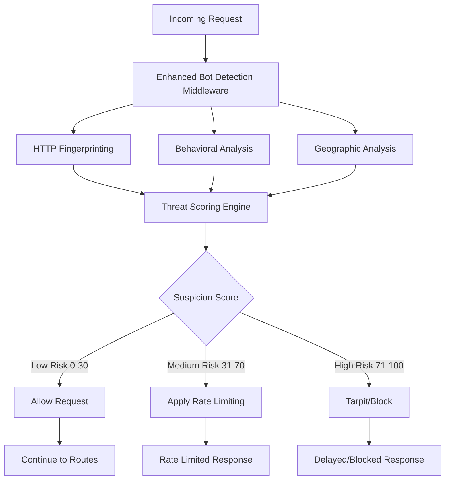

# Enhanced Bot Detection System Design

## Overview

The Enhanced Bot Detection System will replace the current basic user-agent checking with a comprehensive multi-factor analysis system. The design integrates seamlessly with the existing middleware architecture while providing sophisticated threat detection capabilities through HTTP fingerprinting, behavioral analysis, geographic intelligence, and machine learning-based scoring.

## Architecture

### High-Level Architecture



### Integration Points

The system will integrate with existing components:
- **Middleware Chain**: Replace current `isKnownBot` usage in `server.ts`
- **Tarpit System**: Enhanced threat scoring will inform tarpit delays
- **Ban System**: High-risk scores will trigger IP banning
- **Logging**: Structured threat logs with detailed analysis data

## Components and Interfaces

### 1. Core Detection Interface

```typescript
interface DetectionResult {
  isSuspicious: boolean;
  suspicionScore: number; // 0-100
  confidence: number; // 0-1
  reasons: DetectionReason[];
  fingerprint: string;
  metadata: DetectionMetadata;
}

interface DetectionReason {
  category: 'fingerprint' | 'behavioral' | 'geographic' | 'reputation';
  severity: 'low' | 'medium' | 'high';
  description: string;
  score: number;
}

interface DetectionMetadata {
  timestamp: number;
  processingTime: number;
  detectorVersions: Record<string, string>;
  geoData?: GeoLocation;
  behaviorData?: BehaviorMetrics;
}
```

### 2. HTTP Fingerprinting Engine

```typescript
interface HTTPFingerprint {
  headerSignature: string;
  missingHeaders: string[];
  suspiciousHeaders: string[];
  headerOrderScore: number;
  tlsFingerprint?: string;
  automationSignatures: string[];
}

class HTTPFingerprintAnalyzer {
  analyze(req: Request): HTTPFingerprint;
  private calculateHeaderScore(headers: Record<string, string>): number;
  private detectAutomationFrameworks(headers: Record<string, string>): string[];
  private analyzeTLSFingerprint(req: Request): string | undefined;
}
```

### 3. Behavioral Analysis Engine

```typescript
interface BehaviorMetrics {
  requestInterval: number;
  navigationPattern: string[];
  timingConsistency: number;
  humanLikeScore: number;
  sessionDuration: number;
}

class BehaviorAnalyzer {
  private ipSessions: Map<string, SessionData>;
  
  analyze(ip: string, req: Request): BehaviorMetrics;
  private trackSession(ip: string, req: Request): void;
  private calculateTimingScore(intervals: number[]): number;
  private analyzeNavigationPattern(requests: RequestLog[]): string[];
}
```

### 4. Geographic Intelligence

```typescript
interface GeoLocation {
  country: string;
  region: string;
  city: string;
  isVPN: boolean;
  isProxy: boolean;
  isHosting: boolean;
  isTor: boolean;
  riskScore: number;
  asn: number;
  organization: string;
}

class GeoAnalyzer {
  private geoDatabase: MaxMindReader;
  private vpnDatabase: VPNDetectionService;
  
  analyze(ip: string): Promise<GeoLocation>;
  private calculateGeoRisk(location: GeoLocation): number;
  private detectInfrastructureProvider(asn: number): boolean;
}
```

### 5. Threat Scoring Engine

```typescript
interface ScoringWeights {
  fingerprint: number;
  behavioral: number;
  geographic: number;
  reputation: number;
}

class ThreatScoringEngine {
  private weights: ScoringWeights;
  
  calculateScore(
    fingerprint: HTTPFingerprint,
    behavior: BehaviorMetrics,
    geo: GeoLocation
  ): DetectionResult;
  
  private combineScores(scores: number[], weights: number[]): number;
  private determineConfidence(scores: number[]): number;
}
```

## Data Models

### 1. Session Tracking

```typescript
interface SessionData {
  ip: string;
  firstSeen: number;
  lastSeen: number;
  requestCount: number;
  requests: RequestLog[];
  fingerprints: Set<string>;
  suspicionHistory: number[];
}

interface RequestLog {
  timestamp: number;
  path: string;
  method: string;
  userAgent: string;
  headers: Record<string, string>;
  responseTime: number;
}
```

### 2. Configuration Model

```typescript
interface DetectionConfig {
  enabled: boolean;
  scoringWeights: ScoringWeights;
  thresholds: {
    suspicious: number; // Default: 30
    highRisk: number;   // Default: 70
  };
  fingerprinting: {
    requiredHeaders: string[];
    suspiciousPatterns: RegExp[];
    automationSignatures: RegExp[];
  };
  behavioral: {
    minHumanInterval: number; // Default: 500ms
    maxConsistency: number;   // Default: 0.8
    sessionTimeout: number;   // Default: 30min
  };
  geographic: {
    highRiskCountries: string[];
    vpnPenalty: number;
    hostingPenalty: number;
  };
  whitelist: {
    ips: string[];
    userAgents: RegExp[];
    asns: number[];
  };
}
```

### 3. Analytics Data Model

```typescript
interface DetectionAnalytics {
  totalRequests: number;
  suspiciousRequests: number;
  blockedRequests: number;
  falsePositives: number;
  detectionAccuracy: number;
  averageProcessingTime: number;
  topThreats: ThreatSummary[];
  geoDistribution: Record<string, number>;
}

interface ThreatSummary {
  ip: string;
  country: string;
  totalRequests: number;
  averageScore: number;
  lastSeen: number;
  threatTypes: string[];
}
```

## Error Handling

### 1. Graceful Degradation

```typescript
class DetectionErrorHandler {
  handleGeoServiceFailure(ip: string): GeoLocation {
    // Return default geo data with reduced confidence
    return {
      country: 'unknown',
      riskScore: 0,
      // ... other defaults
    };
  }
  
  handleFingerprintingError(req: Request): HTTPFingerprint {
    // Fallback to basic user-agent analysis
    return this.basicFingerprintAnalysis(req);
  }
  
  handleBehaviorAnalysisError(ip: string): BehaviorMetrics {
    // Return neutral behavior metrics
    return this.neutralBehaviorMetrics();
  }
}
```

### 2. Performance Safeguards

```typescript
class PerformanceGuard {
  private readonly maxProcessingTime = 50; // ms
  private readonly circuitBreaker = new CircuitBreaker();
  
  async executeWithTimeout<T>(
    operation: () => Promise<T>,
    fallback: T
  ): Promise<T> {
    try {
      return await Promise.race([
        operation(),
        this.timeoutPromise(fallback)
      ]);
    } catch (error) {
      this.circuitBreaker.recordFailure();
      return fallback;
    }
  }
}
```

## Testing Strategy

### 1. Unit Testing

```typescript
describe('HTTPFingerprintAnalyzer', () => {
  test('should detect missing browser headers', () => {
    const mockRequest = createMockRequest({
      'user-agent': 'Mozilla/5.0...',
      // Missing Accept, Accept-Language headers
    });
    
    const result = analyzer.analyze(mockRequest);
    expect(result.missingHeaders).toContain('Accept');
    expect(result.headerOrderScore).toBeLessThan(0.5);
  });
  
  test('should identify automation frameworks', () => {
    const seleniumRequest = createMockRequest({
      'user-agent': 'Mozilla/5.0 (compatible; selenium)',
    });
    
    const result = analyzer.analyze(seleniumRequest);
    expect(result.automationSignatures).toContain('selenium');
  });
});
```

### 2. Integration Testing

```typescript
describe('Enhanced Bot Detection Integration', () => {
  test('should integrate with existing tarpit middleware', async () => {
    const botRequest = createBotRequest();
    const response = await request(app)
      .get('/test-endpoint')
      .set(botRequest.headers);
    
    expect(response.status).toBe(429);
    expect(response.headers['x-detection-score']).toBeDefined();
  });
  
  test('should not affect legitimate traffic', async () => {
    const legitimateRequest = createLegitimateRequest();
    const response = await request(app)
      .get('/test-endpoint')
      .set(legitimateRequest.headers);
    
    expect(response.status).toBe(200);
    expect(response.time).toBeLessThan(100); // ms
  });
});
```

### 3. Performance Testing

```typescript
describe('Performance Requirements', () => {
  test('should process requests within 50ms', async () => {
    const startTime = process.hrtime.bigint();
    
    await enhancedBotDetection(mockRequest, mockResponse, mockNext);
    
    const endTime = process.hrtime.bigint();
    const duration = Number(endTime - startTime) / 1_000_000;
    
    expect(duration).toBeLessThan(50);
  });
  
  test('should handle 1000 concurrent requests', async () => {
    const requests = Array(1000).fill(null).map(() => 
      enhancedBotDetection(mockRequest, mockResponse, mockNext)
    );
    
    const results = await Promise.all(requests);
    expect(results.every(r => r.processingTime < 100)).toBe(true);
  });
});
```

### 4. Accuracy Testing

```typescript
describe('Detection Accuracy', () => {
  test('should maintain <1% false positive rate', () => {
    const legitimateTraffic = loadLegitimateTrafficSamples();
    const results = legitimateTraffic.map(req => detector.analyze(req));
    
    const falsePositives = results.filter(r => r.suspicionScore > 70);
    const falsePositiveRate = falsePositives.length / results.length;
    
    expect(falsePositiveRate).toBeLessThan(0.01);
  });
  
  test('should detect >95% of known bot traffic', () => {
    const botTraffic = loadKnownBotSamples();
    const results = botTraffic.map(req => detector.analyze(req));
    
    const detectedBots = results.filter(r => r.suspicionScore > 30);
    const detectionRate = detectedBots.length / results.length;
    
    expect(detectionRate).toBeGreaterThan(0.95);
  });
});
```

## Implementation Considerations

### 1. Memory Management

- Use LRU cache for session data with configurable size limits
- Implement automatic cleanup of stale session data
- Monitor memory usage and implement circuit breakers

### 2. Configuration Management

- Support hot-reloading of detection rules and thresholds
- Provide environment variable overrides for all settings
- Include configuration validation and error reporting

### 3. Monitoring and Observability

- Expose Prometheus metrics for detection performance
- Implement structured logging with correlation IDs
- Provide health check endpoints for monitoring systems

### 4. Security Considerations

- Prevent timing attacks through consistent response times
- Sanitize all logged data to prevent log injection
- Implement rate limiting for configuration endpoints
- Use secure defaults for all configuration options